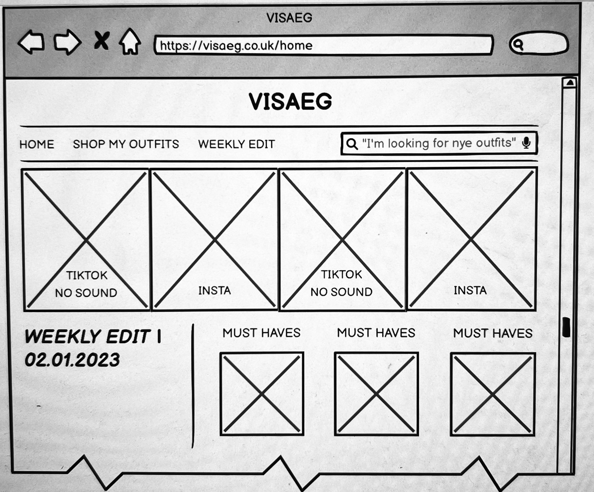
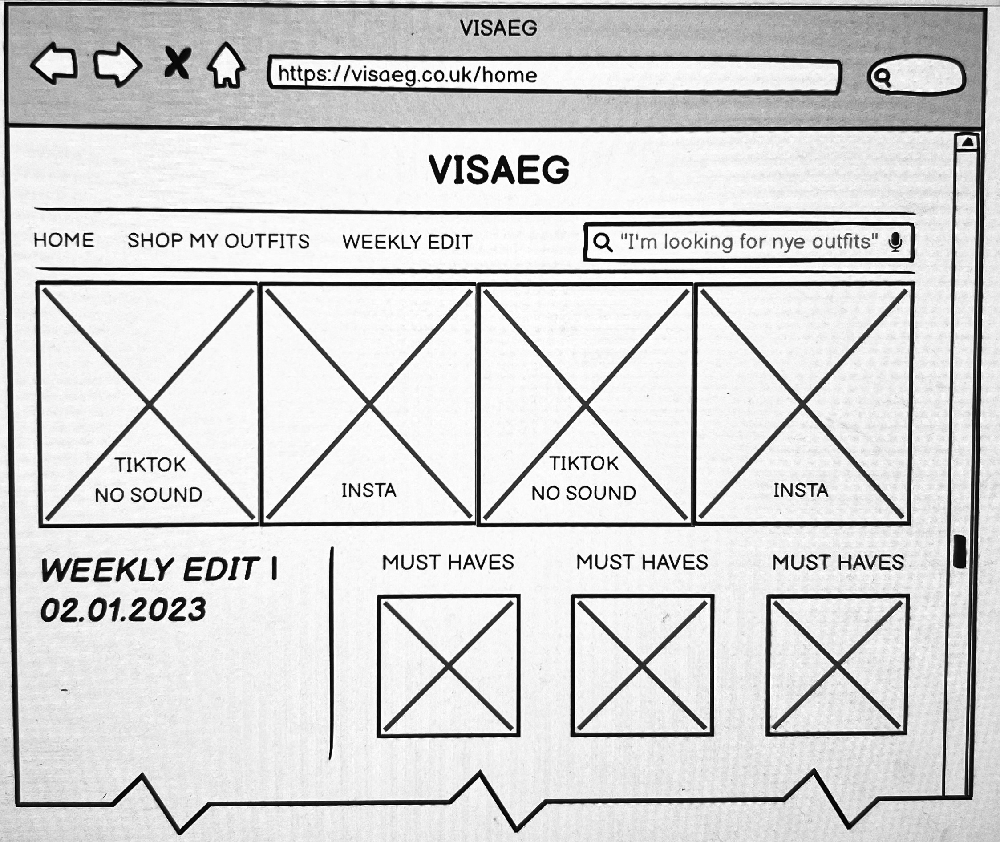
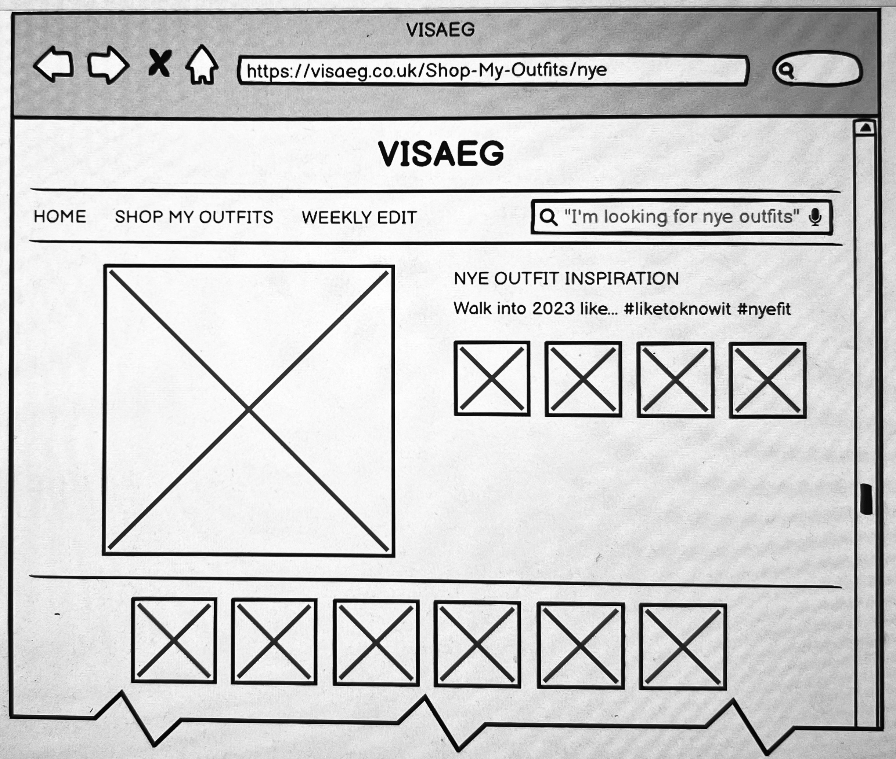
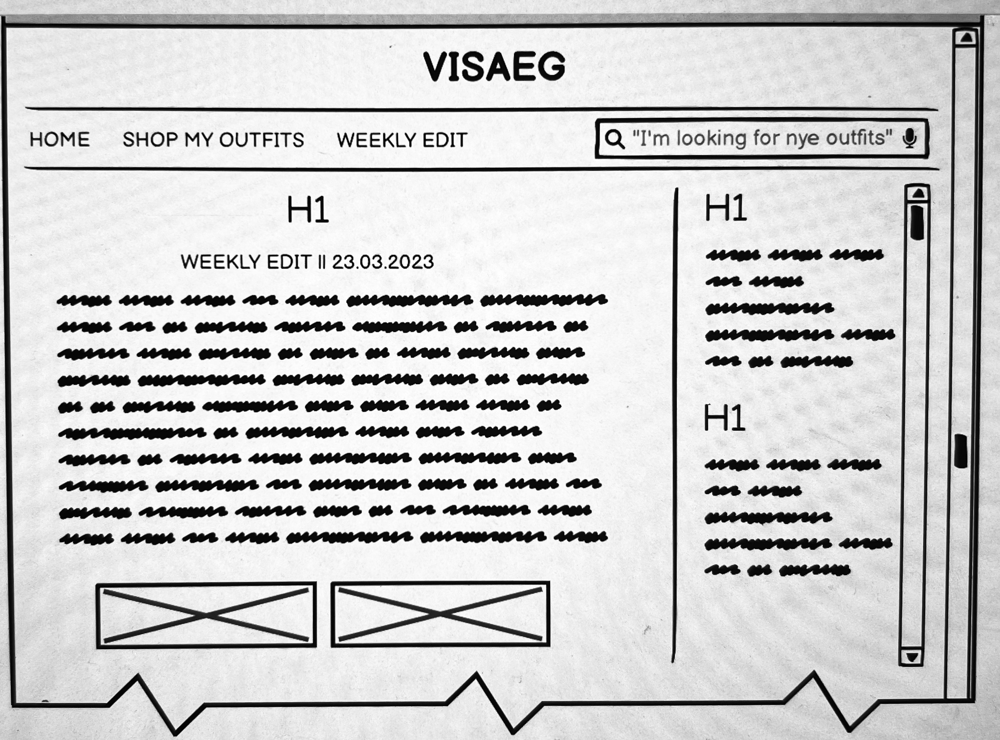

# 
Milestone Project: Visaeg London

[View the live project here](<https://8000-kayanatsule-visaegfashi-bwq40s1ljjf.ws-eu89.gitpod.io/index.html>)

This is the main affiliate marketing website for Visaeg London - a curation of cutting-edge fashion pieces and related articles on body confidence. It is designed to be responsive and accessible on a range of devices, making it easy for women inspired and interested in fashion to shop a range of fashion items - inspired and curated by Kayanat Suleman.

# User Experience (UX)

### **User Stories**
>
> First Time Visitor Goals
>
+ a. As a first time visitor, I want to easily navigate to fashion items as advertised on Kayanat Suleman's Instagram and learn more about her vision in fashion.
+ b. As a first time visitor, I want to be able to easily identify the key areas of the website, and navigate throughout the site to find content with ease.
+ c. As a first time visitor, I want to look for visual recognition of affiliate products that are highlighted on Kayanat Suleman's Instagram account. I also want to locate her social media links to see their followings on social media to determine how trusted and known she is.

>
> Returning Visitor Goals
>
+ a. As a Returning Visitor, I want to find information about new seasonal outfit and products associated with that.
+ b. As a Returning Visitor, I want to read the new articles related to body confidence and to style certain pieces.
+ c. As a Returning Visitor, I want to shop related affiliate products listed on Kayanat Suleman's social media accounts.

>
> Frequent Visitor Goals
>
+ a. As a Frequent User, I want to check to see if there are any newly added articles.
+ b. As a Frequent User, I want to check to see if there are any new article posts on the Weekly Edit section of the website.
+ c. As a Frequent User, I want to sign up to the Newsletter so that I am emailed any major updates and/or changes to the website or organisation. - Future integration.

### **Design**
>
> Color Scheme
>

+ The two main colours used are white, and black to mimic the style of an old school newspaper.
+ The background colour is #f9f7f1 - to resonate with the user idea of a newspaper and help draw the connection between an old school newspaper contrasted by modern images of fashion poses to create interest with the target audience.

>
> Typography
>

+ The Bebas Neue font is small and minimalistic to ensure that the interface remains elegant and subdued - small text also is resonant of a newspaper. To create a plethora of hierarchy I introduced three fonts in total, to complement the design of the website. The headings used the Playfair Display font, and the supporting text used the font EB Garamond to create contrast. The end result was a website that resonated the look and feel of a newspaper, but modern.

>
> Imagery
>

+ Imagery is important. The large, background hero image is designed to be striking and catch the user's attention. It also has a modern aesthetic highlighting the models showcasing their outfits also helps the user understand the purpose of this website. The hero image also creates an interesting landing page which is inviting yet intreging for the user.

### **Wireframe**
>
> + Home Page Wireframe  
> + Shop My Outfits Wireframe 
> + Weekly Edit Wireframe 
>

# Features

+ Responsive on all device sizes - including mobile and tablets.
+ Integrating of LikeToKnow.it widgets to help the user experience when shopping for affiliate links.

# Technologies Used

### **Languages Used**
>
+ [HTML](<https://en.wikipedia.org/wiki/HTML>)

+ [CSS](<https://en.wikipedia.org/wiki/CSS>)
>

### **Frameworks, Libraries & Programs Used**

1. Google Fonts

+ Google fonts were used to import the 'Playfair Display , Bebas Neue, EB Garamond’ font into the style.css file which is used on all pages throughout the project.

2. Font Awesome

+ Font Awesome was used on all pages throughout the website to add icons for aesthetic and UX purposes.

3. Git

+ Git was used for version control by utilising the Gitpod terminal to commit to Git and Push to GitHub.

4. GitHub

+ GitHub is used to store the projects code after being pushed from Git.

5. Procreate

+ Photoshop was used to create the logo, resizing images and editing photos for the website.

6. Balsamiq

+ Balsamiq was used to create the wireframes during the design process.
( link to wireframe part of README.md)

7. Canva

+ Canva was used to help resize screenshots of the website to showcase the plethora of devices that the website can be used on.

# Testing

The W3C Markup Validator and W3C CSS Validator Services were used to validate every page of the project to ensure there were no syntax errors in the project.

+ [W3C HTML Validator: index.html - PASSED]
+ [W3C HTML Validator: stream-two - PASSED]
+ [W3C HTML Validator: stream-three - PASSED]
+ [W3C HTML Validator: stream-four - PASSED]
+ [W3C CSS Validator: css.stylesheet - PASSED]

### **Testing User Stories from User Experience (UX) Section**

>
> First Time Visitor Goals
>
+ i.  As a First Time Visitor, I want to see a clear and clean layout. Greeted with an aesthetic hero image, which depicts the intent of the website - a personal blog curated by a content creator.

  + a. As a user enters the website, they are greeted with an appealing and large logo, which allows them to connect the content creators brand with their personal social accounts.
  + b. The main points are made immediately with the nav bar.
  + c. The user has a concise and well-organised amount of options to click through on the nav bar, however as they scroll the home page they are greeted with two main clearly laid out sections, that help them further understand the use of the website and offer them value, as they search for their next fashion purchase.

+ ii.  As a First Time Visitor, I want to look for testimonials to understand what their users think of them and see if they are trusted. I also want to locate their social media links to see their following on social media to determine how trusted and known they are.

  + a. Once the new visitor has read the About Us and What We Do text, they will notice the Why We are Loved So Much section.
  + b. The user can also scroll to the bottom of any page on the site to locate social media links in the footer.
  + c. At the bottom of the Contact Us page, the user is told underneath the form, that alternatively they can contact the organisation on social media which highlights the links to them.

>
> Returning Visitor Goals
>
+ i.  As a Returning Visitor, I want to find the new articles centred around body positive messages and inspirational advice on how to dress to be confident.

  + a. These are clearly shown on the home page, under the WEEKLY EDIT header
  + b. They will be directed to a page with another hero image and a "click here" assertive comment.

+ ii.  A future integration that would be helpful for a user to contact the content creator would be to add a CONTACT ME section to the footer.

  + a. This would be added to the footer to add ease of collaboration of future brands or if a personal user is curious about advice.

+ iii.  As a Returning Visitor, I want to find the Instagram and Tiktok links easily to my content creators social accounts.

  + a. The Instagram and TikTok social buttons can be found on the footer of the website - which are clickable. They direct the user directly to the associated page.
  + b. Alternatively, the user can find the associated Instagram pages linked on the SHOP MY OUTFITS tab from the navigation bar which is directly linked to the most relevant Instagram page. These links are directly linked to the affiliate links as defined by the Like to Know it widget.
  + c. If the user is on the HOME page of Visaeg then they can access the most recent but condensed favourite items as defined by the content creator - these items are updated automatically and regularly - per month.

>
> Frequent User Goals
>
+ i.  Frequent User, I wanted to ensure that every new post can be added easily onto the website on the Weekly Edit page
  + a. The user would have found this easy to navigate because each new article is published under a new month section.

+ ii.  As a Frequent User, I want to check to see if there are any new weekly edit articles.
  + a. The user would already be comfortable with the website layout and can easily click the weekly edit section - however it would also show on the main home page, where the new articles are published for ease.

+ iii.  As a Frequent User, I want to access the content creators favourite fashion items.
  + a. At the end of the home page- there is an accessible link which portrays the newest favourites of the month as dictated by the content creator. This is easily accessible as the like to know it widget allows the user to click on the item which takes the user directly to that particular item.
  + b. This is also followed by the next page on the website which can be accessible from the nav bar - the SHOP MY OUTFITS section of the website has a distinguished widget asset that allows the user to see all relevant and up to date posts from the content creators - linked directly to the content creators Instagram page. This is updated automatically so that the user is always up to date with the most cutting edge fashion recommendations which are easily shoppable via the direct link to the desired product.
  + c. A future integration that would be useful - would be to add product details to current articles directing the user to associated fashion items. This would increase the usability and usefulness of the article pages.

### **Further Testing**

+ The Website was tested on Google Chrome, Internet Explorer, Microsoft Edge and Safari browsers.
+ The website was viewed on a variety of devices such as Desktop, Laptop, iPhone7, iPhone 8 & iPhoneX.
+ A large amount of testing was done to ensure that all pages were linking correctly.
+ Friends and family members were asked to review the site and documentation to point out any bugs and/or user experience issues.

### **Bug Fixes**
>
> Version 1
>
1. SETUP ISSUES
    + Problem: Can’t see browser preview in terminal (after creating terminal port 8000 using python 3-m http.server.
    + Solution: Use the magnifying glass icon to see the additional browser preview.

2. WEBSITE DEVELOPMENT ISSUES + HTML FILES LINKING:
   + Problem: "a href" elements created as an "ul" list in the "li" format. It does not appear at 3 separate streams.
   + Solution: Each stream link needs its own individual li tag on separate lines.

3. CSS STYLESHEET CONNECTION TO INDEX.HTML ISSUES:
   + Problem: Created a stylesheet called style.css linked stream-one.html. Under the "link ref =“stylesheet” href=“css/style/css" but it doesn’t update the website with the new added styles.
   + Solution: The reason why it didn’t work was because the css was written in capital letters, and the linked as not rightly linked/directed. Also I was connecting the stylesheet to stream-one.html and not by style.css. Also using Emmett don’t work, I have to type things out myself.

4. CSS STYLESHEET APPLICATION ON ALL HTML FILES:
    + Problem: Created assets folder, then put css - stylesheet.css in, as a folder and then put img in as a folder. Applied content to body i.e; purple font, both stream-two.html and stream-three.html work upon testing but stream-one.html doesn’t not.
    + Solution: Fixed link by copy pasting stream 3 data and force refresh from cache using shift and clicking the refresh button.

>
> Version 2
>
1. CSS STYLESHEET FONT APPLICATIONS ON ALL HTML FILES:
    + Problem: Of inserting my personal set of custom fonts using google fonts.
    + Solution: Click on font on google and select @import xyz. Add link to stylesheet, and using preferred css ruling given by google - update css font-family
    Remember @ imports always go at the top of the page.

2. STREAM-ONE UPDATE TO INDEX.HTML:
   + Problem: Stream-one.html = “home page” was called Stream-one across all pages - changed to index.html.
   + Solution: The name of the file was updated across all html links and pages.

3. UPLOADING IMAGE TO ASSETS FOLDER:
   + 7. Problem: Trying to update an image in assets folder > img > logo.png.
    Linked Logo.png using "a href=“assets/img/logo.png>" but no image display.
   + Solution: There was no img tag associated with the certain piece of code.
   + Reference:<https://stackoverflow.com/questions/41468951/images-not-displaying-in-github-pages>

4. CENTERING LOGO:
    + Problem: I want to make the logo.img centre.
    + Solution: Adapted from  stack overflow
    + Reference: <https://stackoverflow.com/questions/35162053/center-logo-in-html>

5. HOW TO ADD A HORIZONTAL LINE:
    + Problem:  How to add a horizontal line break.
    + Solution: Adapted from Hubspot. Overstack recommends: Drop hr and use border-top and border-bottom in conjunction with padding on the div.
    hr should be used as a horizontal rule.
    For instance, a hard separation of paragraph or a long break - and not as a visual element.
    However - decided to HR element - using css to style and width: 1200px max. After some experimentation I liked the visual look of width-max: 1250px.

    + Reference:
    <https://blog.hubspot.com/website/blog/tabid/6307/bid/19727/easy-html-tricks-for-the-non-technical-marketer.aspx#:~:text=Line%20in%20HTML-,To%20make%20a%20horizontal%20line%20in,use%20the%20element.>
    <https://www.w3schools.com/howto/howto_css_style_hr.asp>
    <https://stackoverflow.com/questions/3126995/combining-border-top-border-right-border-left-border-bottom-in-css>

>
> Version 3
>
1. HOW TO GET DESIRED NAVIGATION LOOK:
    + Problem: How to style my navigation bar to get desired look
    + Solution: Add hr element tag, top and bottom of nav element
    + Add CSS styling and # hr { border: 1px solid black; width: 1150px; }
    + Reduce the size of the line height : 15px; and height : 15px of the nav li.
    + Future improvements: I would like the nav bar contents responsive by getting larger when the cursor floats over the options to create a more interactive user experience.

2. WEBSITE STRUCTURE - LOGO.png CONNECTED TO HOME - WHEN CLICKED:
   + Problem: Need to connect the image used for logo to index.html so log take you back to homepage when clicked by user.
   + Solution: add a href tag - to index.html across all html.pages.

3. RESPONSIVE HERO IMAGE:
   + Problem: Add image (hero) img but it is not responding to size change of browser.
   + Solution: How to make img responsive to site changes: .responsive {width: 100% height: auto;}
   + Reference:<https://www.w3schools.com/howto/howto_css_image_responsive.asp>

4. SEARCH BAR INTEGRATION + RESPONSIVENESS:
    + Problem: Add search bar to navigation bar.
    + Solution: Tutorials and code found as referenced below. However issue still persists - changes location on page when browser changes width.
    + Reference: Search Box code used from <https://www.w3docs.com/snippets/css/how-to-create-search-boxes.html>
    To make a more responsive design: <https://www.youtube.com/watch?v=9hF9co-SCKw&t=224s&ab_channel=Viajira>
    + Future improvements: Include a fully functioning search bar that can be used to search the contents of the website and respond with the correct information for users to navigate the website in an easier fashion.

>
> Version 4
>
1. ARTICLE IMPLEMENTATION AND STYLING ISSUES:
    + Problem: make and style a container for text and image per article.
    + Problem: Image not entered
    + Problem: too much white space between both articles on both index.
    html and stream-three.
    + Problem: stream-four article columns need to be aligned side by side to create a 3 column newspaper style.

    + Solution: Using previous knowledge was able to configure some css styling by testing the website after each change to see which style was right for the website.
    + Using previous knowledge on centring images I was able to replicate correct code to centre image in the middle of div by adding padding and assigning a style rule to the immediate html tag.
    + Solution to problem three <https://stackoverflow.com/questions/19038799/why-is-there-an-unexplainable-gap-between-these-inline-block-div-elements>
    + Solution: Exemplar Article here <https://codepen.io/silkine/pen/QWBxVX?editors=1100>

2. FOOTER INTEGRATION & STYLING:
    + Problem: The icons sourced from font awesome do not show on the footer.
    + Problem: the footer would not centre.

    + Solution: Needed to add 'script src="https://kit.fontawesome.com/964b61596d.js" crossorigin="anonymous">script' from font awesome website by creating a kit.
    + Solution: Assign the parent the style attribute of text-align=center

>
> Version 5 & 6
>
+ Final code - passed through validators.

# Deployment

### **GitHub Pages**

The project was deployed to GitHub Pages using the following steps...

+ 1. Log in to GitHub and locate the GitHub Repository (<https://github.com/>)
+ 2. At the top of the Repository (not top of page), locate the "Settings" Button on the menu
+ Alternatively Click Here for a GIF demonstrating the process starting from Step 2. (<https://github.com/> > here needs to be a hyperlink)
+ 3. Scroll down the Settings page until you locate the "GitHub Pages" Section.
+ 4. Under "Source", click the dropdown called "None" and select "Master Branch".
+ 5. The page will automatically refresh.
+ 6. Scroll back down through the page to locate the now published site link in the "GitHub Pages" section.

### **Forking the GitHub Repository**

By forking the GitHub Repository we make a copy of the original repository on our GitHub account to view and/or make changes without affecting the original repository by using the following steps...

+ 1. Log in to GitHub and locate the GitHub Repository (GitHub Repo <https://github.com/>)
+ 2. At the top of the Repository (not top of page) just above the "Settings" Button on the menu, locate the "Fork" Button.
+ 3. You should now have a copy of the original repository in your GitHub account.

# Deployment

### **GitHub Pages**

The project was deployed to GitHub Pages using the following steps...

+ 1. Log in to GitHub and locate the GitHub Repository (<https://github.com/>)
+ 2. At the top of the Repository (not top of page), locate the "Settings" Button on the menu
+ Alternatively Click Here for a GIF demonstrating the process starting from Step 2. (<https://github.com/> > here needs to be a hyperlink)
+ 3. Scroll down the Settings page until you locate the "GitHub Pages" Section.
+ 4. Under "Source", click the dropdown called "None" and select "Master Branch".
+ 5. The page will automatically refresh.
+ 6. Scroll back down through the page to locate the now published site link in the "GitHub Pages" section.

### **Forking the GitHub Repository**

By forking the GitHub Repository we make a copy of the original repository on our GitHub account to view and/or make changes without affecting the original repository by using the following steps...

+ 1. Log in to GitHub and locate the GitHub Repository (GitHub Repo <https://github.com/>)
+ 2. At the top of the Repository (not top of page) just above the "Settings" Button on the menu, locate the "Fork" Button.
+ 3. You should now have a copy of the original repository in your GitHub account.

### **Making a Local Clone**

+ 1. Log in to GitHub and locate the GitHub Repository. (GitHub Repo <https://github.com/>)
+ 2. Under the repository name, click "Clone or download".
+ 3. To clone the repository using HTTPS, under "Clone with HTTPS", copy the link.
+ 4. Open Git Bash.
+ 5. Change the current working directory to the location where you want the cloned directory to be made.
+ 6. Type git clone, and then paste the URL you copied in Step 3 = $ git clone <https://github.com/YOUR-USERNAME/YOUR-REPOSITORY>
+ 7. Press Enter. Your local clone will be created. =
$ git clone <https://github.com/YOUR-USERNAME/YOUR-REPOSITORY>

> Cloning into `CI-Clone`...
> remote: Counting objects: 10, done.
> remote: Compressing objects: 100% (8/8), done.
> remove: Total 10 (delta 1), reused 10 (delta 1)
> Unpacking objects: 100% (10/10), done.
Click Here to retrieve pictures for some of the buttons and more detailed explanations of the above process. (<https://docs.github.com/en/repositories/creating-and-managing-repositories/cloning-a-repository#cloning-a-repository-to-github-desktop>)

# Credits

### **Code**

+ The hero image code came from an accumalation of four pictures sourced from the Kayanat Suleman [Pinterest board](<https://www.pinterest.co.uk/Kayanat_Suleman/vis%C3%A6g/>)

### **Content**

+ All content was written by the developer.
+ Psychological properties of colours text in the README.md was found here

### **Media**

+ Most images were sourced from Pinterest; for exemplar purposes. These will be replaced with personal content from Kayanat Suleman. The images sources can be found on Pinterest in the personal [Kayanat Suleman board.](<https://www.pinterest.co.uk/Kayanat_Suleman/vis%C3%A6g/>)

